# Slack勤怠管理用Bot

### 使用例

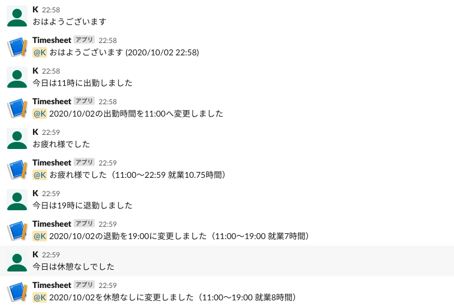

#### 出勤

- おはようございます => 現在時刻で出勤
- 今日は11時に出勤しました => 今日の11時に出勤
- 昨日は11時に出勤しました => 昨日の11時に出勤
- 7月30日は11時に出勤しました => 7/30の11時に出勤

#### 退勤

- お疲れ様でした => 現在時刻で退勤
- 今日は18時に退勤しました => 今日の18時に退勤
- 昨日は１８時に退勤しました => 昨日の18時に退勤
- 7月３０日は18時に退勤しました => 7/30の18時に退勤

#### 休憩

- 今日は休憩なしでした => 今日の休憩をなしにする
- 今日は2時間休憩しました => 今日の休憩を2時間にする

## セットアップ

### git clone
```
git clone https://github.com/devkeita/kintai-bot.git

cd kintai-bot
```

### パッケージをインストール
パッケージをインストール
```
yarn install
```

### .envファイルを作成
プロジェクトフォルダー直下に`.env.sample`をコピーした`.env`ファイルを作成
```
cp .env.sample .env
```

### Slack Appの設定

#### Slack Appを作成する
- [SlackApp](https://api.slack.com/apps)にアクセスする

- `Create　New App`ボタンを押して作成する

  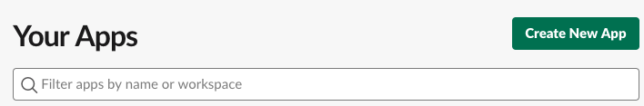
 
  - `App Name`は好きな名前をつける
  - `Development Slack Workspace`は使用するWorkSpaceを選択

    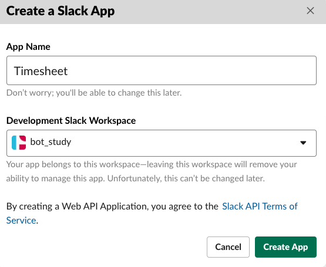
  
- `Basic Information > App Credentials`の`Verification Token`を`.env`にコピペ

  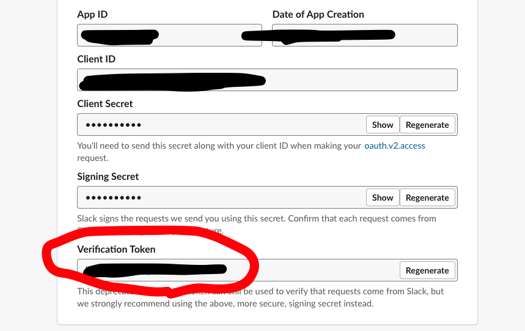

#### Incoming Webhooksを設定
- `Features > Incoming Webhooks`を選択してActivate

  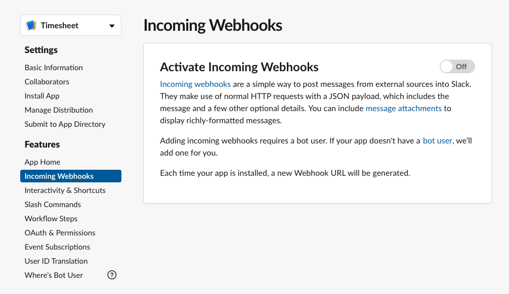

- `Add New Webhook to Workspace`ボタンを押して勤怠管理用のチャンネルを選択

  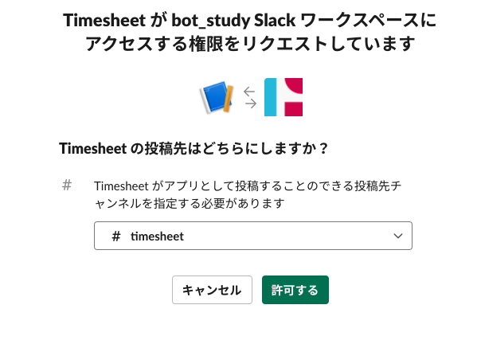

- `Webhook URL`を`.env`ファイルにコピペ

  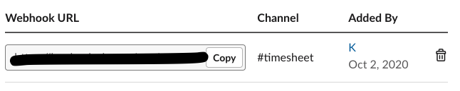

#### Oauthを設定
- `Features > OAuth & Permissions`に移動
- `Bot User OAuth Access Token`を`.env`ファイルにコピペ

  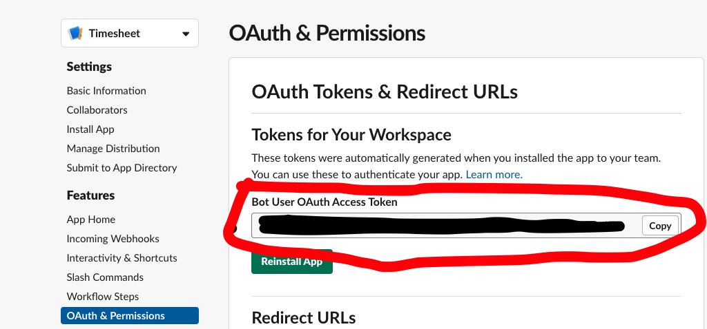
  
- 以下のような警告が出るが一旦無視する

  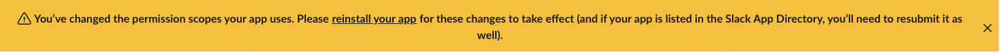

#### Scopeを設定
- `Features > OAuth & Permissions`に移動
- `Scopes`の`Bot Token Scopes`の`Add an OAuth Scope`ボタンを押す
- `users:read`権限を追加する

  

#### Channel Idを設定
- Workspaceの勤怠管理用のチャンネルを選択する
- URLの`https://app.slack.com/client/aaaaaaa/xxxxxxxxxxx`xxxxxxxxxxxの部分を`.env`ファイルにコピペ

  

  ※赤色の部分

### GASの設定

#### claspを使ってgoogleにログイン

```
yarn clasp login
```
ブラウザが開くので使用するアカウントを選択していろいろな権限を許可する

#### google apps scriptのプロジェクトを作成

```
yarn clasp create
```

- `Create which script?`に対して`standalone`を選択

#### .clasp.jsonを設定
`.clasp.json`に以下のように`rootDir`を追加
```
{
  "scriptId": "<your_script_id>",
  "rootDir": "dist"
}
```

#### スプレッドシートIDを設定
- [GASサイト](https://script.google.com/home)にアクセス
- `Kinta-bot`のプロジェクトを開く

  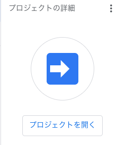

- `ファイル > プロジェクトのプロパティ > スクリプトプロパティ`に移動して`行を追加`ボタンを押す
  - `name`を`SheetID`、`値`を`スプレッドシートのID`に設定する
  
    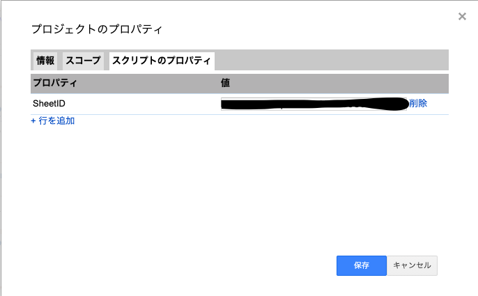

### deploy
```
yarn deploy
```

### GASで公開設定

- GASで　`公開 > Webアプリケーションとして導入`　で公開する

  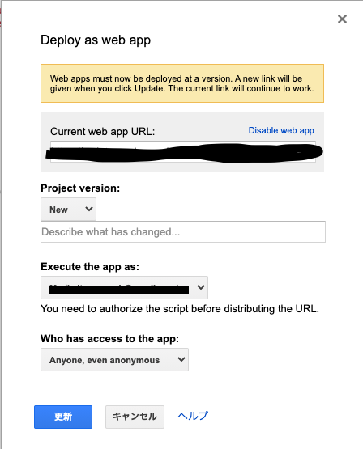
  
- `承認を許可する`というダイアログが出るので許可をする

  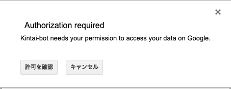

- URLをコピーしておく

  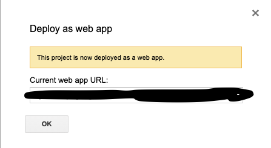

### Slack Event Subscriptionsの設定

#### 有効化する

- [SlackApp](https://api.slack.com/apps)の作成したAppに移動
- `Features > Event Subscriptions`に移動してActivate

  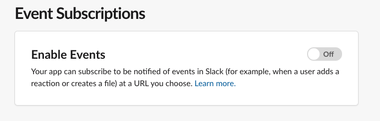

- `Request URL`にGASで公開したURLをコピペ

- `Verified`になる

  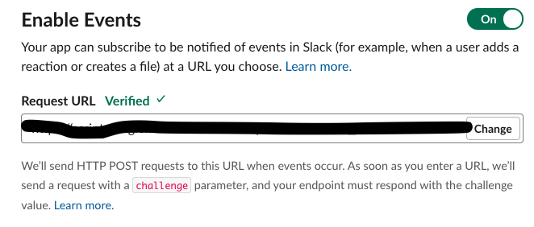

#### `Subscribe to events on behalf of users`を設定
- `Subscribe to events on behalf of users`を押す

  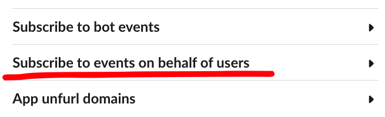

- `Add Workspace Event`ボタンを押す

  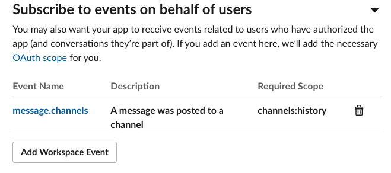

- `message:channels`を追加して`save changes`ボタンを押す

### Slack Appを再インストールする

- `Settings > Install App`に移動する

- `Reinstall App`ボタンを押して再インストール

  

### 完了
